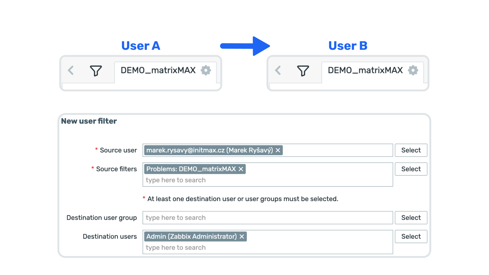

    
    <h3>
        
            Honesty, diligence and MAXimum knowledge of our products is our standard.
        
    </h3>
    <h3>
        &nbsp;&nbsp;&nbsp;
        &nbsp;&nbsp;&nbsp;
        &nbsp;&nbsp;&nbsp;
        &nbsp;&nbsp;&nbsp;
        &nbsp;&nbsp;&nbsp;
        
    </h3>

 

---
---

 
 

    <h1>
        User Filter Manager
    </h1>
    <h4><i>
        Copy, transfer and assign saved filters between users and user groups
    </i></h4>
     
    
    
      
    

 
 

## Description
The User Filter Manager module enables transferring and assigning saved filters between users and user groups, allowing teams to share consistent views across the Zabbix environment. This feature simplifies collaboration and ensures that all team members work with unified, preconfigured monitoring perspectives.

When source filters are modified, administrators can re-run the synchronization using the "Update and run" button to propagate changes to all destination users and groups.

## Supported Locations
- **Monitoring → Problems**
- **Monitoring → Hosts**
- **Monitoring → Latest data**

## Key Features

### Filter Sharing
- **User to User**: Share saved filters from one user to another
- **User to Group**: Distribute filters to entire user groups
- **Filter Synchronization**: Re-run synchronization when source filters change
- **Update and Run**: Use the "Update and run" button to propagate filter updates
- **Consistent Views**: Ensure teams work with the same monitoring perspectives

### Administration
- **Menu Location**: Users → User filter manager
- **Simple Configuration**: Form-based interface for filter distribution
- **Source Selection**: Choose which user's filters to share
- **Target Selection**: Pick specific users or user groups as recipients

### Use Cases
- **Team Standardization**: Share monitoring views across team members
- **Filter Maintenance**: Update filters centrally and re-synchronize to all recipients
- **Onboarding**: Quickly set up new users with proven filter configurations
- **Event Management**: Share event-specific filters (e.g., "Zabbix summit 2025")
- **Dynamic Updates**: Keep team filters up-to-date when source filters evolve

  

    <a href="https://www.initmax.com/wiki/user-filter-manager-2/">
         
        <b>Documentation</b> 
        
    </a>

 
 

---
---

 

    <a href="https://www.initmax.com/">
         initMAX.com
    </a>&nbsp;&nbsp;&nbsp;
    <a href="tel:+420800244442">
         +420800244442
    </a>&nbsp;&nbsp;&nbsp;
    <a href="mailto:info@initmax.com">
         info@initmax.com
    </a>
       
    &nbsp;
    &nbsp;
    &nbsp;
    &nbsp;
    &nbsp;
       
    &nbsp;&nbsp;&nbsp;
    
       
    

