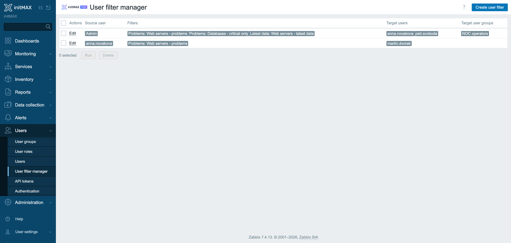
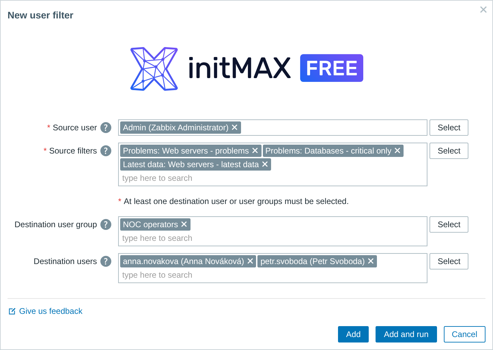
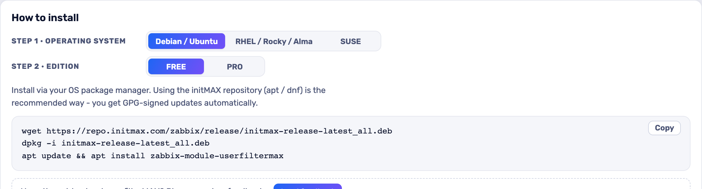

<h1>userfilterMAX</h1>

developed and maintained by

and community

<strong>Copy a saved filter to the people who need it.</strong> 
Zabbix filters are private to whoever created them. When one person builds the filter the whole team should be looking at, the rest have to recreate it by hand - or work without it.

<a href="#what-you-can-build"><strong>Features</strong></a> &nbsp;·&nbsp;
<a href="#examples"><strong>Examples</strong></a> &nbsp;·&nbsp;
<a href="#install"><strong>Install</strong></a> &nbsp;·&nbsp;
<a href="#free-vs-pro"><strong>FREE vs PRO</strong></a> &nbsp;·&nbsp;
<a href="https://portal.initmax.com"><strong>Portal</strong></a> &nbsp;·&nbsp;
<a href="https://www.initmax.com/wiki/user-filter-manager/"><strong>Docs</strong></a>

 

---

## Why userfilterMAX

A good filter is knowledge: which hosts matter, which severities are noise, what the on-call person should see first. Zabbix keeps that knowledge locked to the account that saved it. **User Filter Manager** copies a filter from one user to any number of users or user groups, so the view an experienced engineer built becomes the view the whole team starts from.

## What you can build

<table>
<tr>
<td width="50%" valign="top">

**Team defaults**
Build the filter once, push it to the group, and everyone opens Zabbix on the same picture.

</td>
<td width="50%" valign="top">

**Onboarding**
A new colleague starts with the filters the team actually uses instead of an empty Problems page.

</td>
</tr>
<tr>
<td width="50%" valign="top">

**Handover**
Someone leaves or changes role - their filters move to whoever takes the work on.

</td>
<td width="50%" valign="top">

**Shift views**
Give the night shift its own set of saved filters without anyone rebuilding them.

</td>
</tr>
</table>

## Examples

<table>
<tr>
<td width="50%" align="center" valign="top"> <small><b>Form</b> - Select a source user and saved filter, choose destination users or groups, then copy and run the assignment from one dialog.</small></td>
</tr>
</table>

## Configuration

One page under **Administration**. Choose the source user, pick which of their saved filters to copy, choose the destination users or user groups, and either save the transfer or save and run it at once.

## Install

**FREE** ships as **GPG-signed `deb` / `rpm` packages** from the initMAX repository - `apt` / `dnf` installs them and keeps them updated.

### Easiest way - the guided installer on the Portal

Open the product page, pick your **OS** and **edition**, and copy the ready-made command. FREE is fully public (no login); PRO fills in your token once you sign in. There's a feedback box right there too.

<a href="https://portal.initmax.com/catalog/zabbix-userfiltermax#how-to-install"><strong>→ Open the installer on the Portal</strong></a>

Prefer a plain archive? Every release also ships as a **ZIP** [straight from the repo](https://repo.initmax.com/zabbix/free/zip/userfiltermax/) - handy for offline or manual installs.

The module is enabled automatically during the package installation - verify it in **Administration → General → Modules**. Done.

## FREE vs PRO

There is no paid edition - everything below is in the one package.

| Feature | FREE |
| ---------------------------------------------------------- | :----: |
| Sharing saved filters | ✅ |
| Centralized management | ✅ |
| Support for key Zabbix sections | ✅ |
| User-to-group synchronization | ✅ |
| Localised into all 25 Zabbix display languages | ✅ |
| High availability ready | ✅ |
| Licence | AGPLv3 |

## Requirements

|              |                                                              |
| ------------ | ------------------------------------------------------------ |
| **Zabbix**   | 6.0 · 6.2 · 6.4 · 7.0 · 7.2 · 7.4 - one package covers all    |
| **PHP**      | 7.4 or newer                                                 |
| **OS**       | Debian/Ubuntu · RHEL/Rocky/Alma/Oracle/Amazon · SUSE         |
| **Editions** | FREE (public repo) - there is no paid edition                  |
| **Languages** | All 25 Zabbix display languages - the module follows each user's own language setting |
| **High availability** | Ready. The filters live in the Zabbix database, not on the frontend node; install it on every node of an HA cluster and any node can serve it |

Every capability above works on every supported version - the same page, the same fields, the same labels, in the same order.

One package carries two module trees, because Zabbix accepts a `manifest_version 1` module only below 6.4 and a `manifest_version 2` one only from 6.4 up. The installer picks the right one for the frontend it finds, and picks again if that frontend is later upgraded across the boundary.

Two cosmetic differences come from the older frontends themselves and cannot be fixed from a module:

- **Zabbix 6.0** draws no "?" help icon on the page header - `setDocUrl()` arrived in 6.2. The documentation link in this README is the same one it would open.
- **Zabbix 6.0 and 6.2** keep user administration inside **Administration**, not in a top-level **Users** section, so the menu entry sits under **Administration → User filter manager** there, directly after **Users**.

## Support &amp; links

- **[Documentation / Wiki](https://www.initmax.com/wiki/user-filter-manager/)**
- **[Product page](https://www.initmax.com/product/user-filter-manager/)**
- **[Portal](https://portal.initmax.com)** - downloads, tokens, support tickets
- **Source code (FREE, AGPLv3)** - included in every package and published as a [source archive](https://repo.initmax.com/zabbix/free/zip/userfiltermax/) on repo.initmax.com
- **[support@initmax.com](mailto:support@initmax.com)**

---

FREE: <a href="https://www.gnu.org/licenses/agpl-3.0.html">AGPLv3</a> &nbsp;·&nbsp; © 2021–2026 initMAX s.r.o.

